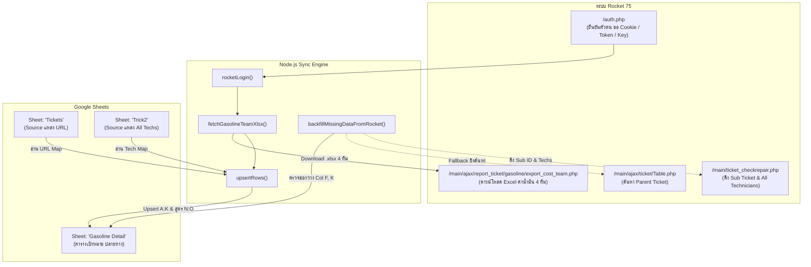

# 📄 ระบบ Sync ข้อมูล Gasoline Detail (ค่าน้ำมันและจำนวนงานรายช่าง)
## System Documentation, Tech Stack & Data Sources

> **เวอร์ชันเอกสาร:** 1.0  
> **อัปเดตล่าสุด:** 12 กันยายน 2026  
> **โมดูลเป้าหมาย:** `github_action/sync-gasoline.js` (และชีท `Gasoline Detail`)  
> **Repository:** `analystsevenfive/sync_rocket_75`  

---

## 📌 1. ภาพรวมระบบ (System Overview)

ชีท **`Gasoline Detail`** เป็นตารางแสดงรายละเอียดรายการงานซ่อม/บริการที่ช่างแต่ละคนได้เข้าปฏิบัติงานจริง เพื่อใช้สำหรับ:
1. ตรวจสอบค่าน้ำมันและจำนวนงานของช่างแต่ละคน (คูณเรท 80 บาท/งาน ตามเงื่อนไข)
2. ให้ฝ่ายที่เกี่ยวข้องตรวจสอบและกรอกอนุมัติ (`Approved` / `Not Approved`) ในคอลัมน์ Review
3. ตรวจสอบรายชื่อช่างทั้งหมดในงาน (`All Technicians`) และลิงก์เข้าดูตั๋วงานบน Rocket 75 (`URL`)

การทำงานของระบบขับเคลื่อนโดยสคริปต์ **`github_action/sync-gasoline.js`** ทำงานผ่าน **GitHub Actions** แบบอัตโนมัติ

---

## 🛠️ 2. เทคโนโลยีที่ใช้ (Tech Stack)

| ส่วนประกอบ (Component) | เทคโนโลยี / เครื่องมือ | รายละเอียดการใช้งาน |
|---|---|---|
| **Runtime Environment** | **Node.js (v20+)** | รัน Engine หลัก รองรับ Native `fetch`, `Buffer`, `Intl.DateTimeFormat` |
| **Automation / CI/CD** | **GitHub Actions** | รันตามตารางเวลา (Schedule Cron) และรันแบบกดมือ (`workflow_dispatch`) ผ่านไฟล์ `.github/workflows/sync-gasoline.yml` |
| **Spreadsheet Integration** | **Google Sheets API v4 (`googleapis` v144+)** | จัดการอ่าน/เขียนข้อมูลบนชีท, Batch Update, จัด Format เซลล์, Data Validation Dropdown, และจัดการ Grid Limit |
| **Excel Parser** | **SheetJS (`xlsx` v0.18.5+)** | อ่านและ Parse ไฟล์ไบนารี Excel `.xlsx` ที่ดาวน์โหลดมาจาก Rocket 75 แบบไม่ต้องพึ่งพา Excel Engine |
| **Scraping & Networking** | **Fetch API + AbortController** | ยิง HTTP Request ไปยัง Rocket 75 พร้อม Session Management และระบบคุม Timeout 120 วินาที |
| **Regex & HTML Parsing** | **Custom Parser (`lib/rocket-client.js`)** | สกัด Parent ID, Sub Ticket ID, ตารางตรวจเช็ค และรายชื่อช่างจาก HTML Response |
| **Legacy Engine (Backup)** | **Google Apps Script (GAS)** | สคริปต์ดั้งเดิม `gasoline.js` (ปิด Trigger อัตโนมัติแล้ว สำรองไว้สำหรับ Manual ในชีท) |

---

## 🌐 3. แหล่งข้อมูลทั้งหมด (All Data Sources & Endpoints)

ระบบ `sync-gasoline.js` เชื่อมโยงแหล่งข้อมูลจากทั้งภายนอกและภายในดังนี้:



### รายละเอียด Endpoints ของ Rocket 75:

1. **Authentication Endpoint:**
   - **URL:** `POST https://rocket75.com/auth.php`
   - **หน้าที่:** ล็อกอินด้วย `ROCKET_USERNAME` และ `ROCKET_PASSWORD` เพื่อรับค่า `PHPSESSID`, `token`, และ `key`

2. **Gasoline Team Export Endpoint (แหล่งข้อมูลหลัก):**
   - **URL:** `POST https://rocket75.com/main/ajax/report_ticket/gasoline/export_cost_team.php`
   - **พารามิเตอร์ที่ส่งไป:**
     - `start_date`: วันที่เริ่มต้น (เช่น `01/07/2026`)
     - `end_date`: วันที่สิ้นสุด (เช่น `12/09/2026`)
     - `search_team`: รหัสทีม 4 ทีมหลัก ได้แก่:
       - `8002371330` : ช่าง A (BK)
       - `6371395077` : ช่าง B (BK)
       - `3696295156` : Training
       - `9751260652` : หัวหน้าช่าง
     - `search_staff`: `'x'` (ระบุเพื่อดึงช่างทุกคนในทีมนั้น)
     - `token`, `key`: ได้รับจากการ Login
   - **ผลลัพธ์ที่ได้:** ไฟล์ Binary Stream ของ Excel `.xlsx` ที่มีรายการงานของช่างในทีมนั้น

3. **ชีท `Tickets` และ `Trick2` (แหล่งข้อมูลเสริมภายใน Google Sheet):**
   - **ชีท `Tickets`:** นำ Ticket No ไปค้นหาเพื่อดึง `URL` ของตั๋วงาน
   - **ชีท `Trick2`:** นำ Ticket No ไปค้นหาเพื่อดึงรายชื่อช่างทั้งหมดที่ทำงานร่วมกัน (`All Technicians`)

4. **Fallback Backfill Endpoints (กรณี URL หรือ All Techs ยังว่าง):**
   - ค้นหาตั๋วในตารางหลัก: `POST https://rocket75.com/main/ajax/ticket/Table.php`
   - ดึงข้อมูลงานย่อยและช่าง: `GET https://rocket75.com/main/ticket_checkrepair.php?id={parentId}`

---

## ⚙️ 4. สถาปัตยกรรมและ Logic การ Sync (`sync-gasoline.js`)

การอัปเดตชีท **ไม่ได้เป็นการสแกนทุกแถวในชีทแล้วไล่ Refresh** แต่ทำงานด้วยสถาปัตยกรรม **Source-Driven Upsert**:

### ขั้นตอนการทำงาน (Step-by-Step Execution):

1. **คำนวณช่วงวันที่ (`computeDateRange`):**
   - วันที่เริ่มต้น: **วันที่ 1 ของ 3 เดือนที่แล้วเสมอ** (เช่น ปัจจุบันเดือน 09/2026 จะเริ่มดึงตั้งแต่ `01/06/2026`)
   - วันที่สิ้นสุด: **วันปัจจุบัน**
   - *หมายเหตุ:* รองรับการ Override ผ่าน ENV `GASOLINE_START_DATE` และ `GASOLINE_END_DATE`

2. **ดึงและรวมข้อมูลจาก Rocket 4 ทีม:**
   - วนลูปยิง `export_cost_team.php` ครบทั้ง 4 ทีม แล้วใช้ `SheetJS` แปลง Excel เป็น Data Array
   - นำข้อมูลทั้ง 4 ทีมมารวมกันเป็น Array `rows`

3. **สร้าง Index จากชีทเดิม (`buildRowIndex`):**
   - อ่านข้อมูลเดิมจากชีท `Gasoline Detail` เริ่มจากแถว 3 ลงไป
   - สร้าง Index ด้วย **Composite Key**:
     $$\text{Composite Key} = \text{Ticket No.} + \text{"\_\_"} + \text{Technician Name}$$
     *(เช่น `BKIN0826-000040.R01__สมชาย ใจดี`)*
   - แมป `ctx.index[compositeKey] = rowNumber` เพื่อรู้ว่ารายการนี้อยู่ที่แถวไหนในชีท

4. **การ Upsert ข้อมูล (`upsertRows`):**
   - **วนลูปเฉพาะข้อมูลที่ได้จาก Rocket ในรอบนี้ (`rows`) เท่านั้น:**
     - **กรณีตรงกับแถวเดิมในชีท (`existingRow`):** ทำการ Update ทับคอลัมน์ A ถึง K และเซ็ต `Last Sync` เป็นเวลาปัจจุบัน
     - **กรณีไม่พบในชีท:** ทำการ Append ต่อท้ายเป็นแถวใหม่ พร้อมสร้างสูตรคอลัมน์ N และ O

5. **Auto-Backfill ข้อมูลที่ขาด (`backfillMissingDataFromRocket`):**
   - ตรวจหาแถวในชีทที่คอลัมน์ `All Technicians` (F) หรือ `URL` (K) ยังว่างอยู่
   - ยิงค้นหาข้อมูลเพิ่มเติมจาก Rocket โดยตรงเพื่อนำมาเติมให้สมบูรณ์

---

## 🔍 5. วิเคราะห์ปัญหา: ทำไมบางรายการจึงไม่โดน Refresh (Last Sync ไม่อัปเดต)

เมื่อตรวจสอบ logic การทำงาน จะเห็นได้ชัดเจนว่า:
> **"สคริปต์วนลูปตามรายการที่ Rocket ส่งมา ไม่ได้วนลูปตามแถวที่มีอยู่ในชีท"**

ดังนั้น หากแถวใดแถวหนึ่งในชีทมีค่า `Last Sync` ค้างเป็นวันก่อนหน้า (เช่น `10/09/2026 7:00:51`) ในขณะที่แถวอื่นเป็นเวลาปัจจุบัน (`12/09/2026 15:02:46`) เกิดจาก 4 สาเหตุหลักดังต่อไปนี้:

```text
┌────────────────────────────────────────────────────────────────────────┐
│ ทำไมแถวนั้นถึงไม่ถูก Refresh? (Root Causes)                            │
├────────────────────────────────────────────────────────────────────────┤
│ 1. ไม่อยู่ในรายงาน Rocket รอบนี้                                       │
│    - Date Arrived เก่ากว่าวันที่ 1 ของ 2 เดือนที่แล้ว (< 01/07/2026)    │
│    - ตั๋ว/ช่าง ถูกย้ายไปทีมนอกเหนือจาก 4 ทีมเป้าหมาย                   │
│    - ตั๋วถูก Cancel, Void หรือลบออกจากระบบ Rocket                      │
│                                                                        │
│ 2. Composite Key ไม่ตรงกัน (TicketNo__TechnicianName)                  │
│    - ชื่อช่างใน Col E ของชีทว่างเปล่า หรือสะกดไม่ตรงกับใน Rocket       │
│    - ระบบหาแถวเดิมไม่เจอ -> มองเป็นแถวใหม่ -> ไป Insert ซ้ำข้างล่างแทน │
│    - แถวเดิมจึงถูกทิ้งค้างไว้ ไม่ได้รับการ Update                      │
│                                                                        │
│ 3. มีแถวซ้ำ (Duplicate) อยู่ในชีทก่อนหน้า                              │
│    - มีตั๋วใบเดียวกัน + ช่างคนเดียวกัน 2 แถวในชีท                      │
│    - buildRowIndex จะจดจำเฉพาะแถวล่าสุด แถวแรกจึงไม่โดนแตะ             │
│                                                                        │
│ 4. แถวนั้นในไฟล์ Excel จาก Rocket ไม่มีเลข Ticket No (Col C ว่าง)       │
│    - extractGasolineTeamRows จะข้ามแถวที่ไม่มี Ticket No ทันที         │
└────────────────────────────────────────────────────────────────────────┘
```

---

## 📋 6. โครงสร้างคอลัมน์ชีท `Gasoline Detail` (Column Layout)

| คอลัมน์ | ชื่อหัวตาราง (Header) | แหล่งที่มา / วิธีการจัดการ |
|:---:|---|---|
| **A** | `Date Arrived` | ดึงจาก Rocket Excel (Col A) |
| **B** | `Job No.` | ดึงจาก Rocket Excel (Col B) |
| **C** | `Ticket No. (BK)` | ดึงจาก Rocket Excel (Col C) — **Primary Matching Key** |
| **D** | `Customer Name` | ดึงจาก Rocket Excel (Col D) |
| **E** | `Technician Name` | ดึงจาก Rocket Excel (Col E) — **Secondary Key** |
| **F** | `All Technicians` | ดึงจากชีท `Trick2` หรือค้นหาจาก Rocket CheckRepair |
| **G** | `Team` | ชื่อทีมที่สกัดจากหัวตารางของไฟล์ Excel Rocket |
| **H** | `Counted` | ค่า 0 หรือ 1 จาก Rocket Excel (Col F) |
| **I** | `Remarks` | หมายเหตุจาก Rocket Excel (Col G) |
| **J** | `Last Sync` | Timestamp วันที่และเวลาที่ทำการ Sync สำเร็จ (เวลากรุงเทพฯ) |
| **K** | `URL` | ลิงก์ตรงไปยังหน้ารายละเอียดตั๋วงานบน Rocket 75 |
| **L** | `Review` | ผู้ใช้เลือกเองจาก Dropdown (`Approved` / `Not Approved`) |
| **M** | `Note` | ผู้ใช้กรอกข้อความเอง (Sync จะไม่เขียนทับ) |
| **N** | `Count Stack` | สูตรอัตโนมัติ: นับลำดับงานที่ได้ค่าน้ำมันสะสมต่อช่าง |
| **O** | `Amount Received` | สูตรอัตโนมัติ: คำนวณยอดเงิน `N * 80` บาท |

---

## 🛡️ 7. แนวทางการตรวจสอบและแก้ไข (Action Plan / Recommendations)

1. **เมื่อพบแถวที่ Timestamp ไม่อัปเดต:**
   - ตรวจสอบคอลัมน์ C (`Ticket No`) แล้วกด `Ctrl + F` ในชีท เพื่อดูว่ามีแถวซ้ำที่ด้านล่างสุดของชีทหรือไม่
   - ตรวจสอบคอลัมน์ E (`Technician Name`) ว่าชื่อช่างในชีทพิมพ์ตรงกับในระบบ Rocket หรือไม่
   - ตรวจสอบวันที่ในคอลัมน์ A (`Date Arrived`) ว่าเป็นงานเก่าก่อนวันที่ 1 ของ 2 เดือนที่แล้วหรือไม่

2. **หากต้องการ Refresh ตั๋วเก่าย้อนหลัง:**
   - ให้รัน GitHub Actions ผ่านเมนู `Run workflow` แบบ Manual (`workflow_dispatch`)
   - กำหนดค่า `start_date` ย้อนหลัง เช่น `01/01/2026` เพื่อบังคับให้ Rocket ดึงข้อมูลครอบคลุมตั๋วเก่าทั้งหมด
